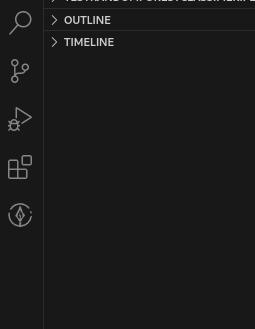
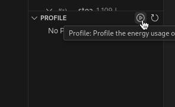
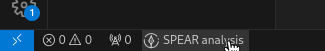
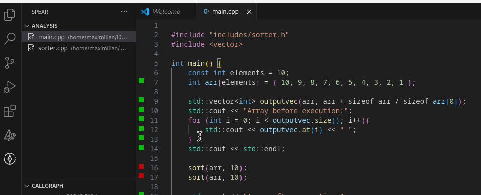
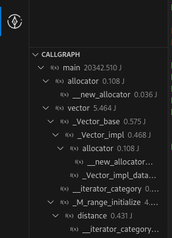
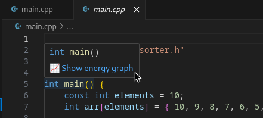

# SPEAR-Viewer

Welcome to the SPEAR-Viewer repository. The SPEAR-Viewer is a [Visual Studio Code](https://code.visualstudio.com/) extension build ontop of [LLVM](https://llvm.org/) and the [SPEAR](https://github.com/printerboi/spear) analysis tool. It adds functionality to VSC enabling developers to visualise the static energy analysis performed by SPEAR.

## Structure

Further information regarding details of the extension can be found in the following strucure:

- [Installation]() How to install the SPEAR Viewer
- [Usage]() How to use the SPEAR Viewer
- [Contributing]() How to contribute to the project
- [Licensing]() How to reuse the SPEAR Viewer

## Installation

Before installing the extension make sure you downloaded and installed SPEAR using the provided installation script.

### Before installing...
⚠️ The provided script uses apt as package manager and was currently only tested on Debian. If you want to use SPEAR and the SPEAR-Viewer a different distro please build the program yourself using the build process described in the SPEAR repository.


⚠️ SPEAR requires an Intel CPU with a architecture supporting the Intel RAPL hardware measurement sensors. See the following [list](https://web.eece.maine.edu/~vweaver/projects/rapl/rapl_support.html) for supported architectures.

### Installing the Extension

In order to install the extension download the `.vsix` file from the [releases](https://github.com/printerboi/spear-viewer/releases) section of this repository.

After downloading the file execute the following steps:

1) Open VSCode and navigate to the extension tab or press <kbd>Ctrl</kbd> + <kbd>Shift</kbd> + <kbd>X</kbd>

2) Click on the `...` above the search bar

3) Click "Install from VSIX" 

4) Search for the downloaded file

5) Enjoy

## Usage

After the installation of the SPEAR-Viewer you will see a new icon in the sidebar of Visual Studio Code



This icon will lead you to the SPEAR analysis hub for the current workspace. Here you can see the files under analysis, the call graph of the current program and calculate a profile.

### Getting started

After you open a new workspace/folder, the SPEAR-Viewer will automatically ask, to create a spear.yml, which represents the config file for the current SPEAR project. A sample config can be found [here](util/sample.config.yml). The options in the config file represent settings used in the analysis

```
version: "1.0"
name: Sample config
analysis:
  loopbound: 100
  strategy: 'worst'
  threshold: 0
profiling:
  iterations: 100
files:
  - path/to/file.cpp
```

Explanation of each option:
- version: Represents the version of the config file, currently this must be `"1.0"`
- name: Name of your SPEAR project.
- loopbound: Defines the value used to over approximate the amount a loop will execute, if it can not be determined by SPEAR.
- strategy: analysis strategy, see the [SPEAR repository](https://github.com/printerboi/spear) for further details.
- threshold: Defines a energy threshold under which energy highlights are hidden.
- iterations: Defines the iterations used for profiling the system, see the [SPEAR repository](https://github.com/printerboi/spear) for further details.
- files: List of files that should be analysed. You can use relative paths here. Make sure to only add .cpp files here.

### Profiling

After you have created a config, you should generate a profile to determine the energy consumption of your system. Switch to the SPEAR tab in the sidebar. There should be a section called "PROFILE". Hover with your mouse over the text until a "Play" symbol is revealed. See the following screenshot for an example:



Click the button to start the profiling. Be aware that the profiling itself needs elevated rights. After some time, the SPEAR-Viewer will tell you that your profile was generated, you are now ready to go. The generated `profile.json` can be found in SPEAR's project directory in the folder `.spear` which should was generated in your workspace/folder.

### Analysing

After you have created a profile, you are well prepared for an analysis of your code. Make sure that the files you want to analyse are in the `files` section of the `spear.yml` config file.
Start the analysis by clicking the "SPEAR analysis" button in the status bar:



The SPEAR-Viewer will automatically start the analysis on your defined files.
After the analysis is complete, the generated `analysis.json` can also be found in the `.spear` project folder. The SPEAR tab will update and show you, the files added to the `files` section of your config file in the "Analysis" section. You can click any of these files. A read only editor will open showing you your code with energy highlights:



You can hover over the lines in the read only editor to see the absolute used energy.

Additional information can be found in the "Callgraph" section of the SPEAR tab. If the analysis was executed correctly, you will see the call graph of the given program here. Additionally, each function is annotated with its energy cost:



We also added the possibility to render the internal programgraph that is used by SPEAR as a coloured graph, where each node will be annotated with its respective energy cost. To generate the graph, switch back to the normal editor, via the file explorer. Hover over the name of the function you want to generate the graph for. A tooltip will appear:



After clicking on the link "Show energy graph", the SPEAR-Viewer will open your standard pdf viewer and display the generated DOT graph.

## Contribute

Please feel free to open issues in this repository and create merge request if you like. Please respect, that I run this repository as side project and can only spend my time partly on developing SPEAR.

If you encounter a problem an want to create a issue, please describe your system and problem detailed as possible. A detailed explanation on how to reproduce the problem should be provided.


## Licensing

As SPEAR and the SPEAR-Viewer were created with the goal of improving the enviromental impact of software development, the usage, reuse in different projects etc. are free under the GPL-3.0 license. Please see the license supplied within this repository for further details